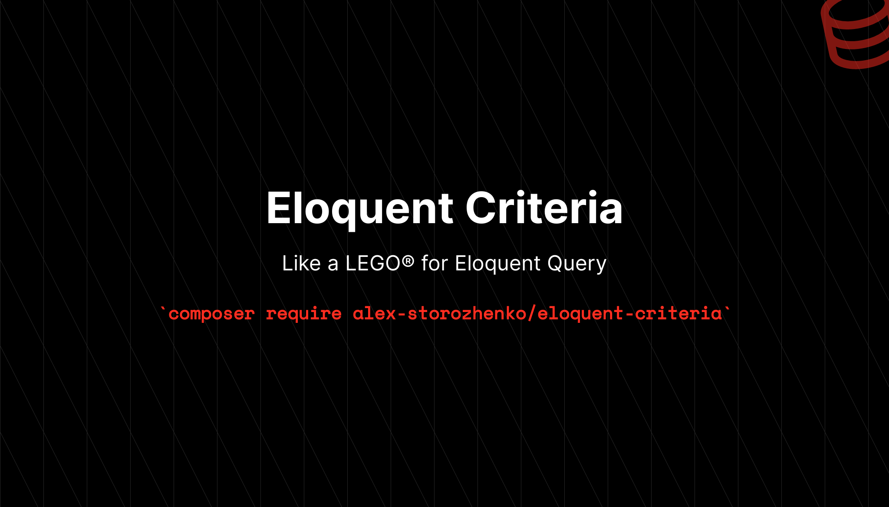

---

# Eloquent Criteria

[](https://packagist.org/packages/alex-storozhenko/eloquent-criteria)
[](https://github.com/alex-storozhenko/eloquent-criteria/actions?query=workflow%3Arun-tests+branch%3Amain)
[](https://github.com/alex-storozhenko/eloquent-criteria/actions?query=workflow%3A"Fix+PHP+code+style+issues"+branch%3Amain)
[](https://packagist.org/packages/alex-storozhenko/eloquent-criteria)

### ⚠️ Compatibility Notes:
Please use 1.x.x version for Laravel 9 compatibility:

```bash
composer require alex-storozhenko/eloquent-criteria ^1.1
```

This is a lightweight implementation of Criteria Builder for Eloquent.
It's like LEGO® for Eloquent Builder, providing easy decoupling and reuse of query modifiers.

Obviously, the main purpose is to modify the query in the specified way, 
since Criteria are very similar to Eloquent scopes, 
only with that they can be applied in different way in a app 
and encapsulate more complex conditions with additional logic in a pretty clean way.

## Installation

You can install the package via composer:

```bash
composer require alex-storozhenko/eloquent-criteria
```

You can publish the config file with:

```bash
php artisan vendor:publish --tag="eloquent-criteria-config"
```

This is the contents of the published config file:

```php
return [
    /*
    |--------------------------------------------------------------------------
    | Macro
    |--------------------------------------------------------------------------
    |
    | This option controls the ability to add a macro to the eloquent builder,
    | which allows, when enabled, to add criteria builder functionality to the eloquent
    | at the global level
    | methods criteriaQuery(), apply() will be added
    | to the Eloquent through the macro
    |
    */
    'macro_enabled' => env('ELOQUENT_CRITERIA_MACRO_ENABLED', false),
];
```

## Usage

There are several ways to get started with the Criteria Builder, one of which is to simply enable the macro
and make it work globally, just add it to your .env file

### Macro

```php
ELOQUENT_CRITERIA_MACRO_ENABLED=true
```
or change a value in config `eloquent-criteria.php`

and let's do magic:

### Criteria class

```php
<?php

declare(strict_types=1);

namespace App\Criteria\User;

use AlexStorozhenko\EloquentCriteria\Contracts\Criteria;
use Illuminate\Database\Eloquent\Builder;

class BannedUser implements Criteria 
{
    public function apply(Builder $builder): Builder
    {
        return $builder->whereNotNull('banned_at');
    }
}
```

and apply to query

```php
<?php

declare(strict_types=1);

...
use App\Criteria\User\BannedUser;

...

User::criteriaQuery()->apply(new BannedUser())->paginate();

// or
User::apply(new BannedUser())->paginate();
```

### Concern

Of course, if you are against macros and prefer to control everything, 
then there is an assistant(concern) for you:

```php
<?php

declare(strict_types=1);

namespace App\Models;

use AlexStorozhenko\EloquentCriteria\Concerns\CriteriaQuery;
use Illuminate\Foundation\Auth\User as Authenticatable;
use AlexStorozhenko\EloquentCriteria\Concerns\CriteriaQuery;

class User extends Authenticatable 
{
    use CriteriaQuery;
} 
```

and you ready do it again:

```php
<?php

declare(strict_types=1);

...
use App\Criteria\User\BannedUser;

...

User::criteriaQuery()->apply(new BannedUser())->paginate();
```

### CriteriaModel

you also can just extend your model:

```php
<?php

declare(strict_types=1);

namespace App\Models;

use Illuminate\Auth\Authenticatable;
use Illuminate\Auth\MustVerifyEmail;
use Illuminate\Auth\Passwords\CanResetPassword;
use Illuminate\Contracts\Auth\Access\Authorizable as AuthorizableContract;
use Illuminate\Contracts\Auth\Authenticatable as AuthenticatableContract;
use Illuminate\Contracts\Auth\CanResetPassword as CanResetPasswordContract;
use Illuminate\Foundation\Auth\Access\Authorizable;
use AlexStorozhenko\EloquentCriteria\Model as CriteriaModel;

class User extends CriteriaModel implements
    AuthenticatableContract,
    AuthorizableContract,
    CanResetPasswordContract
{
    use Authenticatable, Authorizable, CanResetPassword, MustVerifyEmail;
}
```

### Wrapper through for()

finally, if you need to make Eloquent instantly compatible with Criteria, yes, you can:

```php
<?php

declare(strict_types=1);

...
use App\Criteria\User\BannedUser;
use AlexStorozhenko\EloquentCriteria\CriteriaBuilder;

...

CriteriaBuilder::for(User::query())->apply(new BannedUser())->paginate();
```

### CriteriaChain

Of course, you can group your criteria and apply them in a chain, 
for this please use CriteriaChain, 
which compile all of passed in Criteria to executable chain of query modifiers:

```php
<?php

declare(strict_types=1);

...
use App\Criteria\User\BannedUser;
use AlexStorozhenko\EloquentCriteria\CriteriaBuilder;
use AlexStorozhenko\EloquentCriteria\Support\CriteriaChain;
use AlexStorozhenko\EloquentCriteria\Contracts\Criteria;

...

$haveNotLastName = new class() implements Criteria
{
    public function apply(Builder $builder): Builder
    {
        return $builder->whereNull('last_name');
    }
};
    
CriteriaBuilder::for(User::query())->apply(new CriteraChain(new BannedUser(), $hasNotLastName))->paginate();
```

At first glance, 
it may seem that all this can be replaced with model scopes that are available out of the box in Laravel, 
yes, but if you need to have groups of modifiers, 
and also your modifier will build a query based on several conditions that are defined outside the model, 
this can be very overloading model classes.

For example, in the following case, 
I think the Criteria class looks much better than the model scopes with the requirements
passing requests and applying conditions of, 
and if you imagine that this logic possibly can be extended by other conditions:

```php
<?php

declare(strict_types=1);

namespace App\Criteria\Common;

use AlexStorozhenko\EloquentCriteria\Contracts\Criteria;
use Illuminate\Database\Eloquent\Builder;
use App\Criteria\Concern\HttpFilters;
use App\DataObject\Filter;
use Illuminate\Http\Request;

class ByRequestFiltersCriteria implements Criteria 
{
    use HttpFilters; // Dirty job of parsing request query
    
    public function __construct(private readonly Request $request) {}
    
    public function apply(Builder $builder): Builder
    {
        /** @var Filter $filter */
        foreach ($this->getFilters() as $filter) {
            $builder->{$filter->getMethod()}(...$filter->getMethodArguments());
        }
        
        return $builder;
    }
}
```

---

As you can see, Criteria Builder provides absolute freedom of usage approaches,
so it is up to you to decide how best to implement it in your application architecture.

## Testing

```bash
composer test
```

## Changelog

Please see [CHANGELOG](CHANGELOG.md) for more information on what has changed recently.

## Contributing

Please see [CONTRIBUTING](CONTRIBUTING.md) for details.

## Security Vulnerabilities

Please if you found any security issues, write the details to my email: [a.storozhenko@live.com](mailto:a.storozhenko@live.com)

## Credits

- [Alex Storozhenko](https://github.com/alex-storozhenko)
- [All Contributors](../../contributors)

## License

The MIT License (MIT). Please see [License File](LICENSE.md) for more information.
